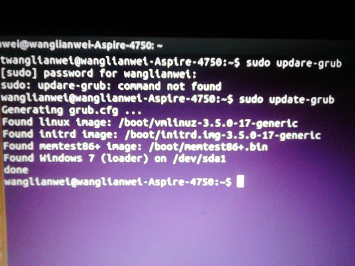
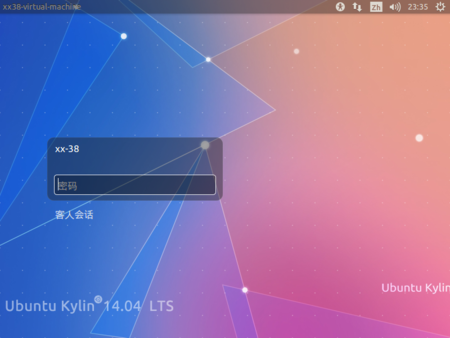

# my diray1
这一周，我原本准备装上linux双系统，但是在我装了双系统之后，我的D盘直接消失了，整个D盘被linux系统一个占据，在资源管理器里D盘依然存在，但是我并不可以使用D盘。并且在我计算机寻找原因，在找寻D盘的过程中，最后通过资源管理器把D盘格式化，再一次重启的时候，导致我的计算机无法正常启动，最后进入了 grub rescue 引导模式，然后，我们班的人建议我把win7重装成了win10，并且将整个电脑格式化，导致所有东西全部消失。
  
  
  导致以上的结果，可能是因为我自己在装双系统的时候没有对整个磁盘进行明确的分盘处理，导致系统的崩溃，同学解释是因为win7竞争不过linux导致了整个D盘的失踪。
  在最后，我还是放弃了对双系统的追求，改装了虚拟机。
  
